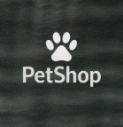

# 🐾 Petshop Demo v0.1

<p align="center">
  
</p>

### 🛍️ Modern Web Demo for an Online Pet Store

A responsive web demo for a fictional pet store — built to showcase front-end design, interactivity, and modern UI principles.  
Developed using **HTML**, **CSS**, and **JavaScript**, this project simulates a basic e-commerce experience with product listings and dynamic interface elements.

---

## ✨ Features

- 🐶 Clean, modern design with responsive layout  
- 🐱 Interactive product cards and hover animations  
- 🐾 Organized structure for scalability  
- 🛒 Ready to extend with checkout and cart systems  
- 📱 Mobile-friendly layout for all devices  

---

## 🧠 Tech Stack

| Technology | Purpose |
|-------------|----------|
| **HTML5** | Page structure |
| **CSS3** | Styling & layout |
| **JavaScript (ES6)** | Interactivity |
| **Git & GitHub** | Version control |
| **Git LFS** | Large file management |

---

## 🚀 How to Run

1. Clone the repository:
   ```bash
   git clone https://github.com/Vdamoulas/Petshop-demo-v-0.1.git
